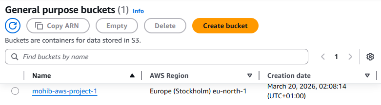
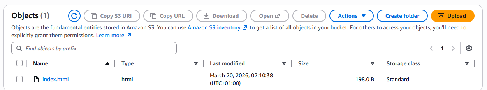
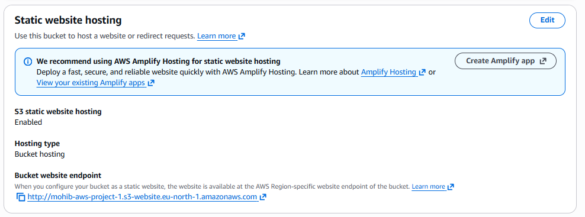
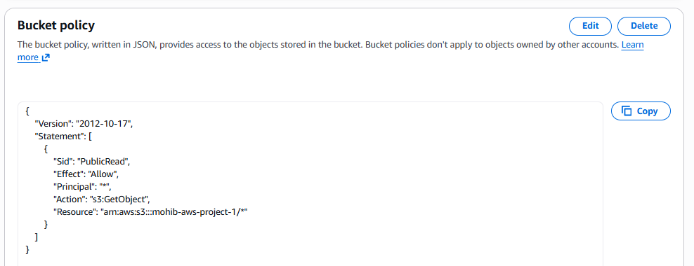
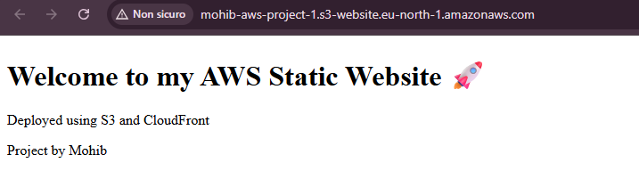
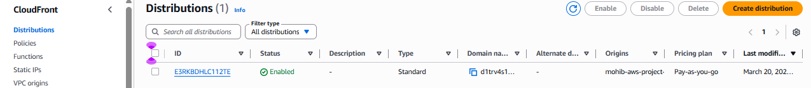
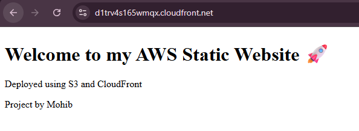

# AWS Static Website Project (S3 + CloudFront)

## 📌 Overview
In this project, I created and deployed a static website using Amazon S3 and distributed it globally using Amazon CloudFront.

## 🚀 Services Used
- Amazon S3 (static website hosting)
- Amazon CloudFront (Content Delivery Network)

## 🛠️ Steps Performed

1. Created a simple static website by writing an `index.html` file locally.
2. Created an S3 bucket named `mohib-aws-project-1`.
3. Disabled block public access to allow public access to the website.
4. Uploaded the `index.html` file to the S3 bucket.
5. Enabled static website hosting in the bucket properties.
6. Configured a bucket policy to allow public read access.
7. Verified that the website was accessible using the S3 website endpoint.
8. Created a CloudFront distribution to improve performance and reduce latency.
9. Connected CloudFront to the S3 website endpoint.
10. Disabled WAF (not required for this project).
11. Waited for deployment and successfully accessed the website via CloudFront URL.

## 📸 Screenshots

### 1. S3 Bucket

### 2. File Upload

### 3. Static Hosting

### 4. Bucket Policy

### 5. Website via S3

### 6. CloudFront Distribution

### 7. Website via CloudFront

## 🌐 Result
The website is successfully deployed and accessible globally through CloudFront with improved performance and low latency.

## 📚 What I Learned
- How to create and host a static website using S3
- How to configure bucket policies and permissions
- How to use CloudFront as a CDN
- The difference between S3 website endpoint and REST endpoint
- Basic troubleshooting (AccessDenied error)

## 👨‍💻 Author
Mohib
